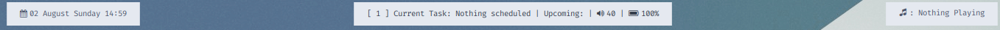

# material_green_i3
## Preview:

## Things to remember:
* The status bar is *tint2* and it uses the given *tint2rc*.
* The scripts *multistat*, *toDo*, *clearToDo* and *modToDo* must be stored in /bin/
* The script *music.sh* must be stored in the HOME directory.
* To play music, your songs must be stored in *~/Music/All*
* The rofi theme *rofi.rasi* must be saved in /usr/share/rofi/themes/ and can be activated using rofi-theme-selector.
* *.wallpaper.jpg* and *.wallpaper2.jpg* should be in the HOME directory.
* You can run sudo *sh install.sh* to automatically perform the above tasks, however it must be run as root. Proceed with caution.

## The bar:

* The tint2 bar is running the *multistat* script for status.

## Programs required:
* Rofi
* tint2
* sox (for music)
* xfce4-terminal (optional, but can be used with the terminalrc for the colorscheme)
